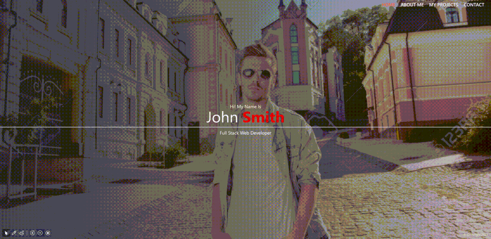
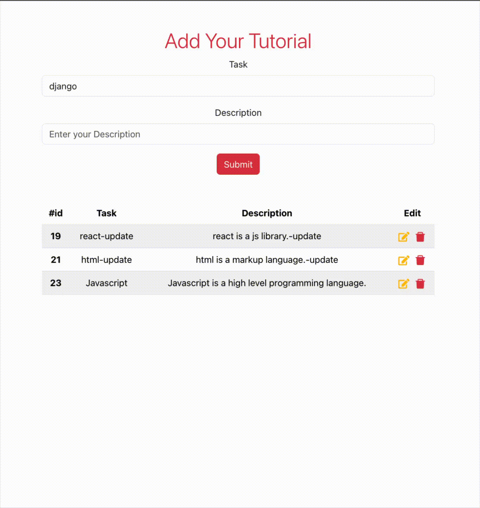
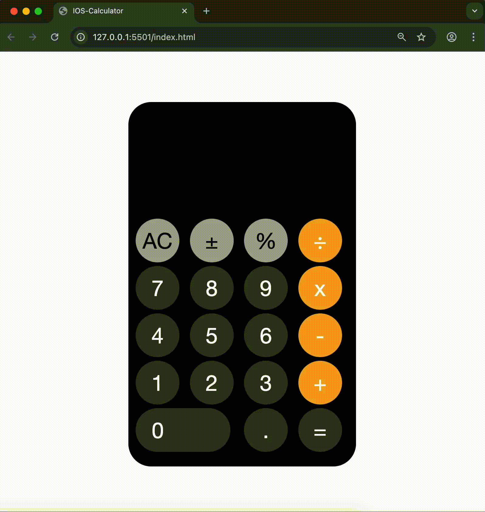

## 👋 Hi there

Hi, I’m **Ümit**.
**Fullstack Developer | React & Django Specialist | AI-Native Workflow Enthusiast 🚀**  
💻 **Core Stack:** JavaScript, React, Redux Toolkit, Python, Django, PostgreSQL  
🚀 **Focus:** Frontend architecture, REST API integration, Isolated CI/CD Workflows (Staging/Production), authentication flows, CRUD systems, and responsive UI  
🌱 **Currently:** Building production-grade apps using AI-first development tools and agentic IDEs  
👯 **Open to:** Full-Stack opportunities and technical collaboration  
📫 **Contact:** [LinkedIn](https://www.linkedin.com/in/%C3%BCmit-arat-189bb1193/) • [Gmail](mailto:umitarat8098@gmail.com)

 

## 🌐 Connect with Me  

 

# 💻 Frontend  

## 🚀 Featured Frontend Projects  

<table>
  <!-- Row 1 -->
  <tr>
    <td width="50%">
      <h2 align="center">🏎️ Rent A Car App (Fullstack)</h2>
      
A production-grade Fullstack Rent A Car application Implemented an advanced development workflow with isolated 

  **Staging** and **Production** environments.
      
  - **Frontend:** React (Vite) deployed on Vercel with automated branch-based previews.
  - **Backend:** Django REST Framework on Railway, leveraging PostgreSQL (Neon) and AWS S3 for media.
  - **Infrastructure:** Professional CI/CD pipeline where staging changes are tested before merging into production.
      

      

        
        
        
        
        
        
        
      
      
      

        <a href="https://rent-a-car-app-three.vercel.app/">🔗 Live Demo</a>
          &nbsp;&nbsp;&nbsp;&nbsp;
        <a href="https://github.com/umitarat-dev/Rent-A-Car-App.git">📂 Repository</a>
      

      

        
      

    </td>
    <td width="50%">
      <h2 align="center">✈️ Flight App (Fullstack)</h2>
      
A production-ready Flight Reservation system featuring <b>Token Authentication</b> and role-based access control. Implemented a professional monorepo architecture with isolated 

  **Staging** and **Production** workflows.
      
  - **Frontend:** React (Vite) on Vercel, integrated with a dual-branch deployment strategy.
  - **Backend:** Django REST Framework on Railway, utilizing Neon PostgreSQL for data persistence.
  - **Security:** Secured with CORS/CSRF protections and automated CI/CD pipelines for safe deployments.
      

      

        
        
        
        
        
        
        
      

      

        <a href="https://flight-app-umit.vercel.app/">🔗 Live Demo</a>
          &nbsp;&nbsp;&nbsp;&nbsp;
        <a href="https://github.com/umitarat-dev/Flight-App.git">📂 Repository</a>
      

      

        
      

    </td>
  </tr>
  <!-- Row 2 -->
  <tr>
    <td width="50%">
      <h2 align="center">📝 Blog App - React (Firebase & Netlify)</h2>

Mobile-first blog platform with Firebase Authentication, Firestore CRUD, image upload, like interactions, protected routes, and persistent dark/light mode.

      

        
        
        
        
        
        
        
      
      
      

        <a href="https://blog-umitdev.netlify.app/">🔗 Live Demo</a>
          &nbsp;&nbsp;&nbsp;&nbsp;
        <a href="https://github.com/umitarat-dev/Blog-App.git">📂 Repository</a>
      

      

        
      

    </td>
    <td width="50%">
      <h2 align="center">📰 News App - React (Firebase & Netlify)</h2>
      
React news app with Firebase Auth, protected routing, Redux Toolkit state management, and secure NewsAPI integration via Netlify Functions.
      

      

        
        
        
        
        
        
      

      

        <a href="https://news-app-umitdev.netlify.app/">🔗 Live Demo</a>
          &nbsp;&nbsp;&nbsp;&nbsp;
        <a href="https://github.com/umitarat-dev/News-App.git">📂 Repository</a>
      

      

        
      

    </td>
  </tr>
  <!-- Row 3 -->
  <tr>
      <td width="50%">
      <h2 align="center">📌 Recipe App React - MultiPage (Edamam API)</h2>
      
Advanced Recipe Search application integrated with Edamam API. Features secure environment configuration on Vercel, asynchronous data fetching, and modular Styled Components architecture.
      

      

        
        
        
      
      
      

        <a href="https://recipe-app-react-umitdev.vercel.app/">🔗 Live Demo</a>
          &nbsp;&nbsp;&nbsp;&nbsp;
        <a href="https://github.com/umitarat-dev/Recipe-App-React.git">📂 Repository</a>
      

      

        
      

    </td>
    <td width="50%">
      <h2 align="center">🎬 Movie App – Firebase Auth</h2>
      
Movie discovery app using Firebase Authentication and TMDB API with route-based navigation and reusable React components.

      

        
        
        
      

      

        <a href="https://movie-app-umitdev.netlify.app/">🔗 Live Demo</a>
          &nbsp;&nbsp;&nbsp;&nbsp;
        <a href="https://github.com/umitarat-dev/Movie-App.git">📂 Repository</a>
      

      

        
      

    </td>
  </tr>
</table>
 

  
<b>🔍 View More Frontend Projects (Click to expand)</b>

   
  <table>

  <!-- Row 4 -->
  <tr>
      <td width="50%">
      <h2 align="center">📌 Contacts App - React (Firebase)</h2>
      
Contact management app with Firebase Authentication, user-based data isolation, and full CRUD operations in a responsive Material UI interface.

      

        
        
        
        
      

      

        <a href="https://contacts-app-umitdev.netlify.app">🔗 Live Demo</a>
          &nbsp;&nbsp;&nbsp;&nbsp;
        <a href="https://github.com/umitarat-dev/Contacts-App.git">📂 Repository</a>
      

      

        
      

    </td>
    <td width="50%">
      <h2 align="center">🅱️ Bootstrap-Education-Landing-Page</h2>
      
Responsive Education Landing Page built with Bootstrap 5. Highlights the effective use of Bootstrap's grid system, utility classes, and interactive components like Carousels, Modals, and Tabs for a seamless user experience.

      

        
        
      

      

        <a href="https://umitarat-dev.github.io/Bootstrap-Education-Landing-Page/">🔗 Live Demo</a>
          &nbsp;&nbsp;&nbsp;&nbsp;
        <a href="https://github.com/umitarat-dev/Bootstrap-Education-Landing-Page.git">📂 Repository</a>
      

      

        
      

    </td>
  </tr>

  <!-- Row 5 -->
  <tr>
  <td width="50%">
      <h2 align="center">🎨 Sass-Portfolio-Landing-Page</h2>
      
Responsive landing page built with Sass architecture, reusable style structure, and modern UI section layout.
      

      

        
        
      

      

        <a href="https://umitarat-dev.github.io/Sass-Portfolio-Landing-Page/">🔗 Live Demo</a>
          &nbsp;&nbsp;&nbsp;&nbsp;
        <a href="https://github.com/umitarat-dev/Sass-Portfolio-Landing-Page.git">📂 Repository</a>
      

      

        
      

    </td>
    <td width="50%">
      <h2 align="center">📋 Tutorial Manager React Client</h2>
      
Frontend client for a Full-Stack Tutorial Management system. Orchestrates secure, environment-driven CRUD operations using React and Axios, integrated with a live Django REST Framework backend.
      

      

        
        
      
      

        <a href="https://umitarat-dev.github.io/Tutorial-Manager-React-Client">🔗 Live Demo</a>
          &nbsp;&nbsp;&nbsp;&nbsp;
        <a href="https://github.com/umitarat-dev/Tutorial-Manager-React-Client.git">📂 Repository</a>
      

      

        
      

    </td>
  </tr>

  <!-- Row 6 -->
  <tr>
    <td width="50%">
      <h2 align="center">📱 iOS Calculator</h2>
      
High-fidelity iOS Calculator clone developed with Vanilla JavaScript. Orchestrates complex arithmetic logic and seamless DOM manipulations for a premium user experience.
      

      

        
        
      
      

      <a href="https://umitarat-dev.github.io/JS-IOS-Calculator/">🔗 Live Demo</a>
        &nbsp;&nbsp;&nbsp;&nbsp;
      <a href="https://github.com/umitarat-dev/JS-IOS-Calculator.git">📂 Repository</a>
      

      

        
      

    </td>
    <td width="50%">
      <h2 align="center">🛒 Javascript-Shopping-Cart-Logic</h2>
      
Interactive shopping cart application built with Vanilla JavaScript. Demonstrates advanced DOM manipulation using Event Delegation (Capturing/Bubbling), real-time pricing calculations, and Web Storage API integration.

      

        
        
      
      

        <a href="https://umitarat-dev.github.io/Javascript-Shopping-Cart-Logic/">🔗 Live Demo</a>
          &nbsp;&nbsp;&nbsp;&nbsp;
        <a href="https://github.com/umitarat-dev/Javascript-Shopping-Cart-Logic.git">📂 Repository</a>
      

      

        
      

    </td>
  </tr>

  <!-- Row 7 -->
  <tr>
    <td width="50%">
      <h2 align="center">🗺️ Tour Experience Explorer</h2>
      
React travel listing app with reusable card components, dynamic rendering, and responsive Sass-based UI styling.
      

      

        
        
        
        
      
      

        <a href="https://tour-experience-explorer-umitdev.vercel.app/">🔗 Live Demo</a>
          &nbsp;&nbsp;&nbsp;&nbsp;
        <a href="https://github.com/umitarat-dev/Tour-Experience-Explorer.git">📂 Repository</a>
      

      

        
      

    </td>
    <td width="50%">
      <h2 align="center">🗣️ Polyglot-DevCards</h2>
      
A dynamic programming language gallery featuring real-time search and interactive card-flipping logic. Built with React to demonstrate advanced state handling, conditional rendering, and custom UI design patterns.
      

      

        
        
        
        
      
      
      

        <a href="https://polyglot-dev-cards.vercel.app/">🔗 Live Demo</a>
          &nbsp;&nbsp;&nbsp;&nbsp;
        <a href="https://github.com/umitarat-dev/Polyglot-DevCards.git">📂 Repository</a>
      

      

        
      

    </td>
  </tr>

  <!-- Row 8 -->
  <tr>
    <td width="50%">
      <h2 align="center">🚀 Persistent Taskflow</h2>
      
A professional React task management system utilizing LocalStorage for permanent data retention. Features dynamic state toggling, interactive UI feedback, and optimized performance.
      

      

        
        
        
      
      
      

        <a href="https://persistent-taskflow-umitdev.vercel.app/">🔗 Live Demo</a>
          &nbsp;&nbsp;&nbsp;&nbsp;
        <a href="https://github.com/umitarat-dev/Persistent-Taskflow.git">📂 Repository</a>
      

      

        
      

    </td>
    <td width="50%">
      <h2 align="center">📝 VanillaJS TaskVault</h2>
      
A high-performance task management application engineered with Vanilla JavaScript. Features seamless LocalStorage persistence, optimized DOM manipulation using DocumentFragments, and event-driven state synchronization for reliable data retention without external frameworks.
      

      

        
        
        
        
      

      

        <a href="https://umitarat-dev.github.io/VanillaJS-TaskVault/">🔗 Live Demo</a>
          &nbsp;&nbsp;&nbsp;&nbsp;
        <a href="https://github.com/umitarat-dev/VanillaJS-TaskVault.git">📂 Repository</a>
      

      

        
      

    </td>
  </tr>

  <!-- Row 9 -->
  <tr>
    <td width="50%">
      <h2 align="center">🌍 Global Insight Explorer</h2>
      
An advanced geography explorer fetching real-time global data. Demonstrates high-level asynchronous patterns, concurrent API requests using Promise.all, and UI consistency management through render sequencing.
      

      

        
        
        
        
      
      
      

        <a href="https://umitarat-dev.github.io/Global-Insight-Explorer/">🔗 Live Demo</a>
          &nbsp;&nbsp;&nbsp;&nbsp;
        <a href="https://github.com/umitarat-dev/Global-Insight-Explorer.git">📂 Repository</a>
      

      

        
      

    </td>
    <td width="50%">
      <h2 align="center">⚛️ Modern-Route-Matrix</h2>
      
An advanced React 19 architecture featuring React Router v7. Demonstrates professional routing patterns, including private route orchestration, nested layout management, and dynamic data synchronization.
      

      

        
        
        
        
      
      
      

        <a href="https://modern-route-matrix.vercel.app/">🔗 Live Demo</a>
          &nbsp;&nbsp;&nbsp;&nbsp;
        <a href="https://github.com/umitarat-dev/Modern-Route-Matrix.git">📂 Repository</a>
      

      

        
      

    </td>
  </tr>
  </table>

 
 

# ⚙ Backend  

### 🚀 Featured Backend Projects  

 

<table>
  <!-- Row 1 -->
  <tr>
    <!-- Card 1 -->
    <td width="50%" valign="top">
      <h2 align="center">✈️ Flight Reservation API</h2>
      

        <strong>Production-ready</strong> API featuring <strong>Docker</strong> orchestration, <strong>PostgreSQL</strong> integration, and automated cloud deployment.
      

      

        
        
        
        
        
      
    
      

        <a href="https://flight-reservation-api-production.up.railway.app/swagger/">🔗 Live Demo</a>
          &nbsp;&nbsp;&nbsp;&nbsp;
        <a href="https://github.com/umitarat-dev/flight-reservation-api.git">📂 Repository</a>
      

      

        
      

    </td>
    <!-- Card 2 -->
    <td width="50%" valign="top">
      <h2 align="center">📝 Blog REST API</h2>
      
RESTful blog backend with JWT authentication and CRUD endpoints for posts, categories, and user-specific content operations.

      

        
        
        
      
      
      

        <a href="https://umit8114.pythonanywhere.com/">🔗 Live Demo</a>
          &nbsp;&nbsp;&nbsp;&nbsp;
        <a href="https://github.com/Umit8098/Project_Django_Rest_Framework_Blog_App_CH-12_V.02.git">📂 Repository</a>
      

      

        
      

    </td>
  </tr>

  <!-- Row 2 -->
  <tr>
    <!-- Card 1 -->
    <td width="50%" valign="top">
      <h2 align="center">👤 Personnel Management REST API</h2>
      
Personnel management API with token-based authentication, filtering, and permission-controlled CRUD operations.

      

        
        
        
      
      

        <a href="https://umit8100.pythonanywhere.com/">🔗 Live Demo</a>
          &nbsp;&nbsp;&nbsp;&nbsp;
        <a href="https://github.com/Umit8098/Project_Django_Rest_Framawork_Personnel_App_CH-12.git">📂 Repository</a>
      

      

        
      

    </td>
    <!-- Card 2 -->
    <td width="50%" valign="top">
      <h2 align="center">✅ Todo REST API</h2>
      
Task management REST API with authenticated CRUD endpoints and integrated API documentation via Swagger and Redoc.

      

        
        
      
      

        <a href="https://umit8101.pythonanywhere.com/">🔗 Live Demo</a>
          &nbsp;&nbsp;&nbsp;&nbsp;
        <a href="https://github.com/Umit8098/Project_Django_Rest_Framework_Todo_App_CH-12.git">📂 Repository</a>
      

      

        
      

    </td>
  </tr>

  <!-- Row 3 -->
  <tr>
    <td width="50%" valign="top">
      <h2 align="center">📝 Quiz REST API</h2>
      
Quiz platform API supporting categories, question sets, answer flows, and score calculation logic.

      

        
        
      
      

        <a href="https://umit8102.pythonanywhere.com/">🔗 Live Demo</a>
          &nbsp;&nbsp;&nbsp;&nbsp;
        <a href="https://github.com/Umit8098/Project_Django_Rest_Framework_Quiz_App_CH-11_V.01.git">📂 Repository</a>
      

      

        
      

    </td>
    <td width="50%" valign="top">
      <h2 align="center">📊 Stock API – REST API</h2>
      
Inventory management API with purchase/sales workflows, stock tracking, and relational data modeling.

      

        
        
      
      

        <a href="https://umit8103.pythonanywhere.com/">🔗 Live Demo</a>
          &nbsp;&nbsp;&nbsp;&nbsp;
        <a href="https://github.com/Umit8098/Project_Django_Rest_Framework_Stock_App_CH-13.git">📂 Repository</a>
      

      

        
      

    </td>
  </tr>
  </table>

   

  
<b>⚙️ View More Backend Systems & APIs</b>

   
  <table>

  <!-- Row 4 -->
  <tr>
    <td width="50%" valign="top">
      <h2 align="center">🚗 Rent A Car REST API</h2>
      
Car rental backend API implementing vehicle CRUD, reservation management, and availability-based business rules.

      

        
        
      
      

        <a href="https://umit8104.pythonanywhere.com/">🔗 Live Demo</a>
          &nbsp;&nbsp;&nbsp;&nbsp;
        <a href="https://github.com/Umit8098/Project_Django_Rest_Framework_Rent_A_Car_App_CH-12.git">📂 Repository</a>
      

      

        
      

    </td>
    <td width="50%" valign="top">
      <h2 align="center">🔐 Google Auth API – Allauth</h2>
      
Django authentication API integrating Google OAuth2 (django-allauth) for secure social login and account flow handling.

      

        
        
      
      

        <a href="https://umit8110.pythonanywhere.com/">🔗 Live Demo</a>
          &nbsp;&nbsp;&nbsp;&nbsp;
        <a href="https://github.com/Umit8098/Proj_Auth_Dj_Allauth_Google_Official_doc_CH-11_V.02.git">📂 Repository</a>
      

      

        
      

    </td>
  </tr>

  <!-- Row 5 -->
  <tr>
    <td width="50%" valign="top">
      <h2 align="center">📝 Blog App – FullStack</h2>
      
Full-stack Django blog app combining REST endpoints with template-based UI and complete content CRUD workflows.

      

        
        
      
      

        <a href="https://umit8112.pythonanywhere.com/">🔗 Live Demo</a>
          &nbsp;&nbsp;&nbsp;&nbsp;
        <a href="https://github.com/Umit8098/Proj_Django_Temp_Blog_App_CH-8.git">📂 Repository</a>
      

      

        
      

    </td>
    <td width="50%" valign="top">
      <h2 align="center">✅ Todo App – FullStack</h2>
      
Full-stack task manager with Django Templates UI, authentication, and REST-backed task lifecycle operations.

      

        
        
      
      

        <a href="https://umit8106.pythonanywhere.com/">🔗 Live Demo</a>
          &nbsp;&nbsp;&nbsp;&nbsp;
        <a href="https://github.com/Umit8098/Project_Django_Templates_Authantication-1_Todo_App_Class_Based_CH-11.git">📂 Repository</a>
      

      

        
      

    </td>
  </tr>

  <!-- Row 6 -->
  <tr>
    <td width="50%" valign="top">
      <h2 align="center">🌦️ Weather App – FullStack</h2>
      
Weather search application with Django Templates frontend and REST API integration for location-based forecast retrieval.

      

        
        
      
      

        <a href="https://umit8108.pythonanywhere.com/">🔗 Live Demo</a>
          &nbsp;&nbsp;&nbsp;&nbsp;
        <a href="https://github.com/Umit8098/Proj_WeatherApp-API-_Temp_Auth-2_email_CH-11_V.04.git">📂 Repository</a>
      

      

        
      

    </td>
    <td width="50%" valign="top">
      <h2 align="center">🍕 Pizza App – FullStack</h2>
      
Full-stack ordering system with Django Templates interface and REST API backend for pizza order processing.

      

        
        
      
      

        <a href="https://umit8111.pythonanywhere.com/">🔗 Live Demo</a>
          &nbsp;&nbsp;&nbsp;&nbsp;
        <a href="https://github.com/Umit8098/Project_Django_Templates_Pizza_App_CH-12_V.03.git">📂 Repository</a>
      

      

        
      

    </td>
  </tr>
</table>

 
 

# ☁️ Cloud & Deployment  

  

 

# 🛠 Tools  

 

## 📊 GitHub Stats  

&nbsp;

  

 

## 🐍 Snake Animation

